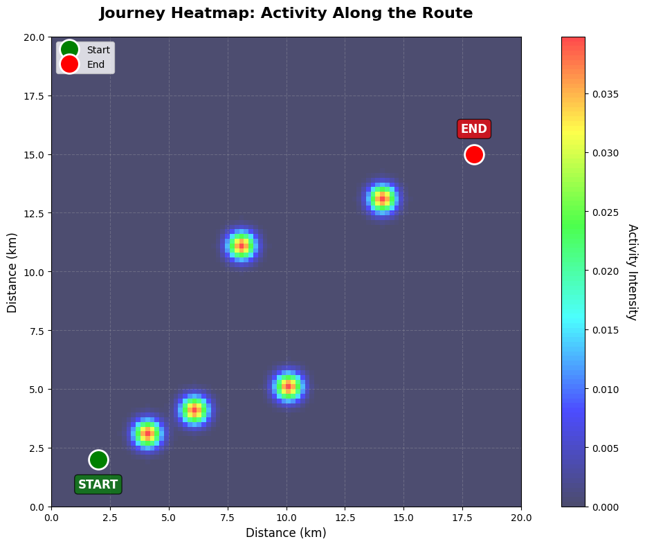
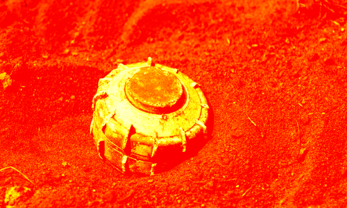
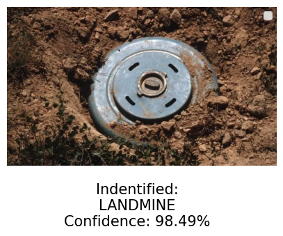
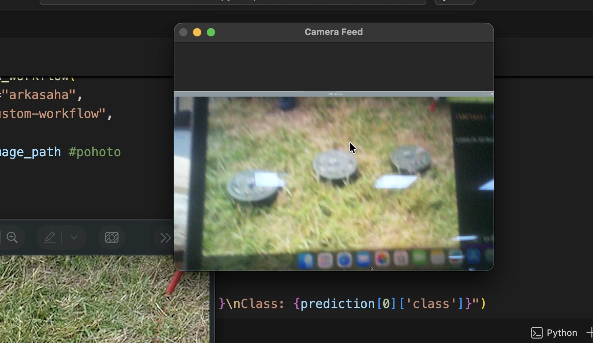

# Autonomous Swarm-Based Quadruped System for Landmine Risk Detection & Hazard Marking
### Indigenous Military Technology
 
## 📌 Overview

This project presents an autonomous swarm of quadruped robots designed to identify landmine-prone zones using vision-based machine learning and collaborative swarm intelligence. The system assigns probabilistic risk scores to terrain regions, physically marks hazardous zones using fluorescent indicators, and generates real-time heatmaps for remote monitoring.

The objective is to reduce accidental exposure of civilians, wildlife, and field personnel in landmine-affected regions.

---

## 🎯 Key Features

* 🧠 Vision-based terrain anomaly detection using ML
* 🤖 Swarm consensus-based risk validation
* 🎨 Non-contact fluorescent hazard marking
* 🗺️ Real-time location heatmap generation
* 📡 Centralized reporting and monitoring system
* 🌍 Designed for humanitarian landmine risk mitigation

---

## 🏗️ System Architecture

1. Swarm deployment in target terrain
2. Multi-sensor terrain scanning (RGB / Thermal / Environmental)
3. Local ML-based anomaly classification
4. Swarm consensus & confidence refinement
5. Hazard threshold validation
6. Fluorescent marking of high-risk zones
7. Real-time reporting to command dashboard

---

## 🗺️ Location Heat Map

---

## 🌡️ Thermal Scanning Module

*(Insert thermal anomaly detection image below)*

---

## 🧨 Landmine Risk Classification Model

*(Insert terrain classification visualization / confusion matrix / sample prediction output below)*

---

## 📤 System Output & Hazard Marking

*(Insert final marked terrain output image below)*

---

## 📊 Future Enhancements

* Multi-modal sensor fusion (GPR integration)
* Improved terrain generalization models
* Adaptive swarm coverage algorithms
* Edge-AI optimization for low-power deployment

---

## 🌍 UN Sustainable Development Goals Alignment

* **SDG 16 – Peace, Justice and Strong Institutions**
* **SDG 3 – Good Health and Well-Being**
* **SDG 15 – Life on Land**

---
